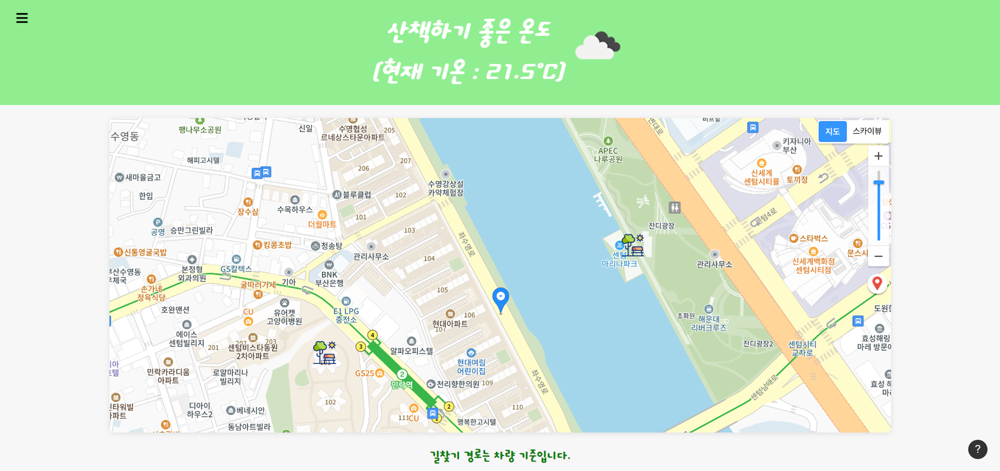

# 산책가자

[https://www.notion.so](https://www.notion.so)

[https://www.notion.so](https://www.notion.so)

---

‘산책가자’는 현재 위치 혹은 본인이 검색한 곳 근처의 2km 범위 내에 공원을 찾아주는 프로그램입니다.

SITE 👉 [**https://restpark.netlify.app**](https://restpark.netlify.app/)

## 👨‍💻개발환경

---

**HTML | CSS | JavaScript**

## 🔍주요기능

---

**현재 위치 표시**

**온도 및 날씨 감지**

**검색기능**

**길 찾기 기능**

**고온 / 저온 경보 기능**

**etc**

1. ESC를 누르면 검색창이 나타나고 한 번 더 누르면 검색창이 들어갑니다
2. Tap 키를 누르면 내 현재 위치로 돌아갑니다
    - 지도 확대 / 축소 밑의 빨간 핀을 눌러도 내 현재 위치로 돌아갑니다
3. 현재 위치의 온도와 검색한 곳의 온도가 실시간으로 반영됩니다
    - 만약 너무 덥거나 추우면 프로그램이 온도를 읽어 경고창으로 알려드립니다
4. 근처의 공원을 누르면 공원까지의 길찾기 경로(자동차 기준)가 나옵니다
5. 검색 후 번거롭게 검색창을 닫을 필요가 없습니다